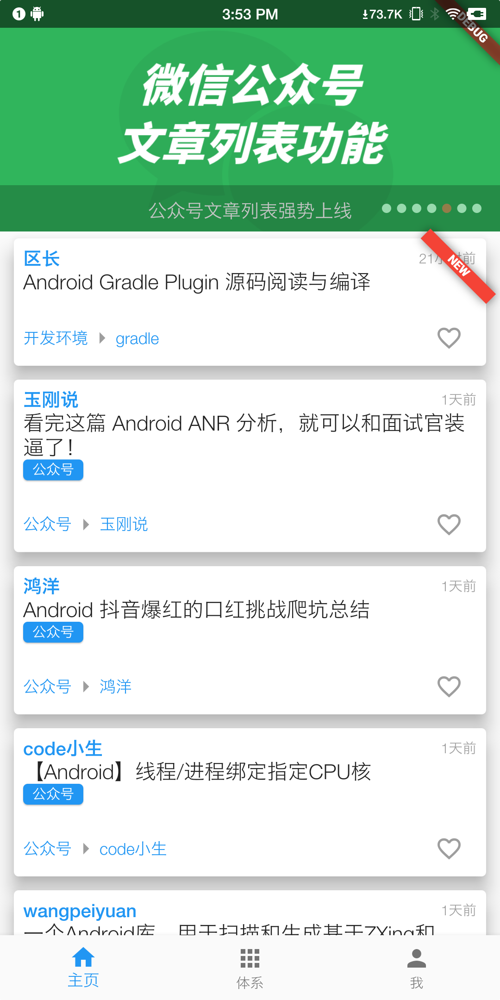
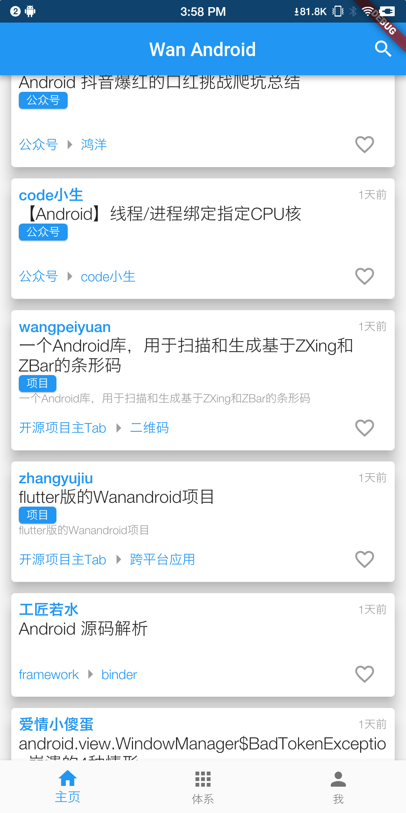
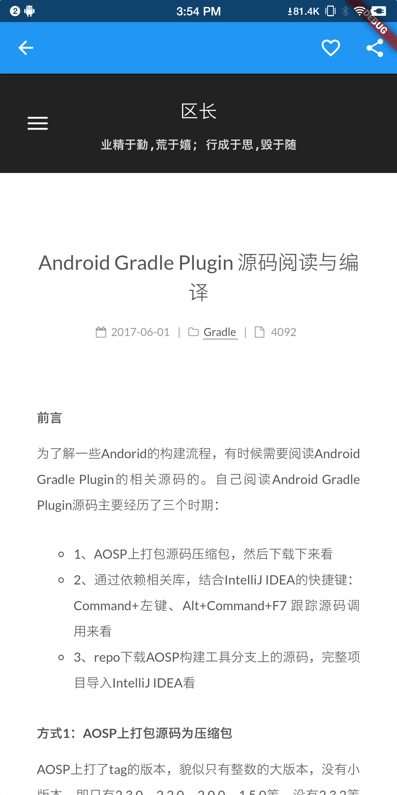
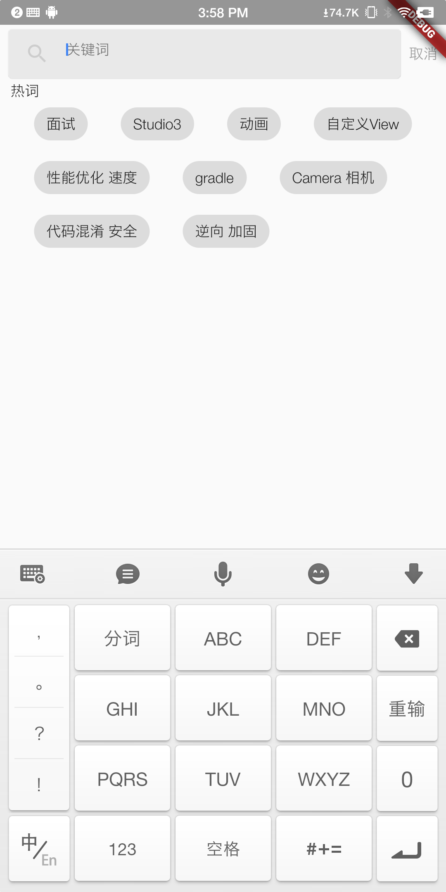
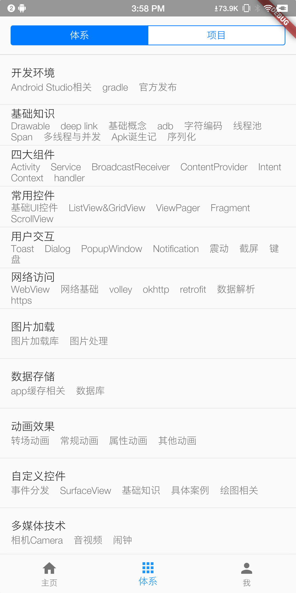
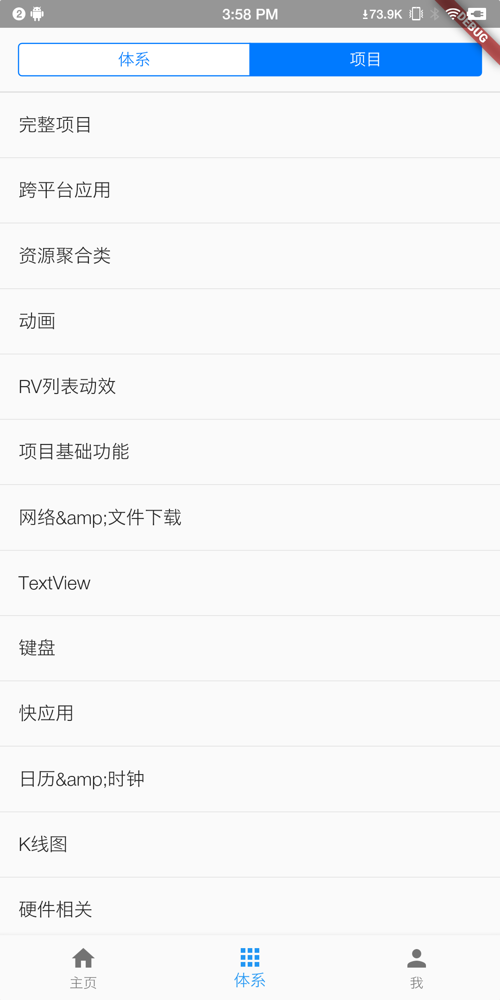
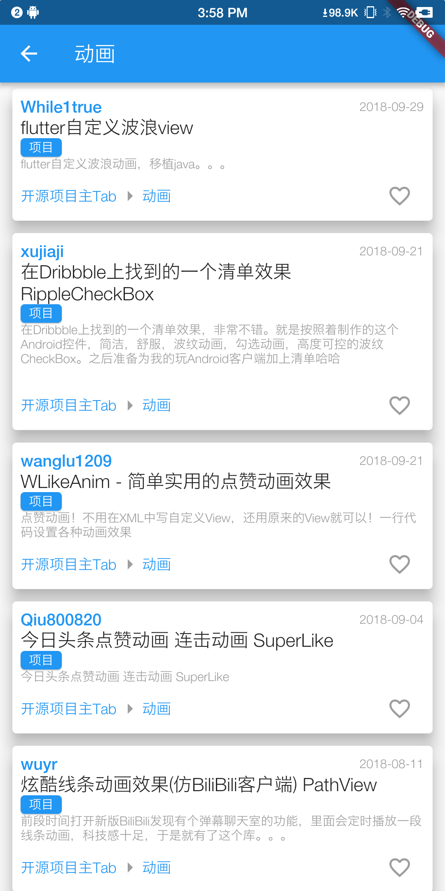
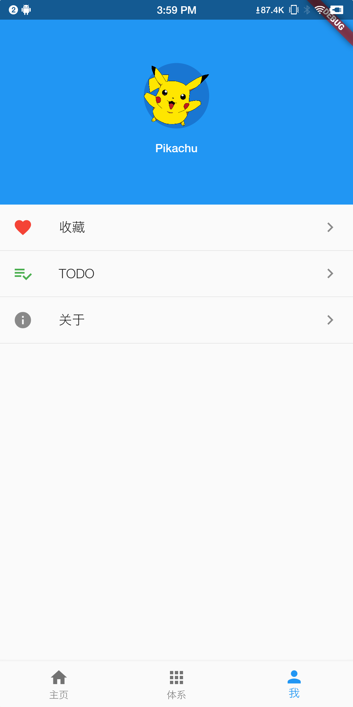

# wan_android

基于玩[安卓网站](http://wanandroid.com/)开发的客户端版本。
使用flutter开发。
由于尚未完成，加上flutter开发的widget和api暂不全面，所以某些功能暂时缺失。
本项目持续开发中...

## DemoApp下载

点击此[链接](screenshot/wan_android.apk?raw=true)下载App

## 部分截图

基于暂时的已完成部分，展示图如下，

>主页

>详情页

>搜索页

>体系

>我

